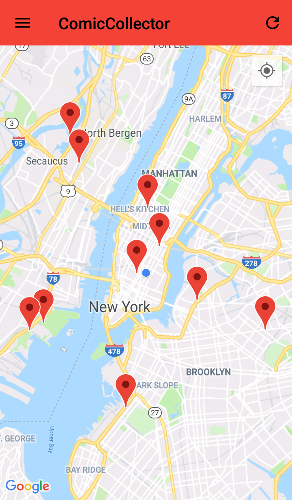
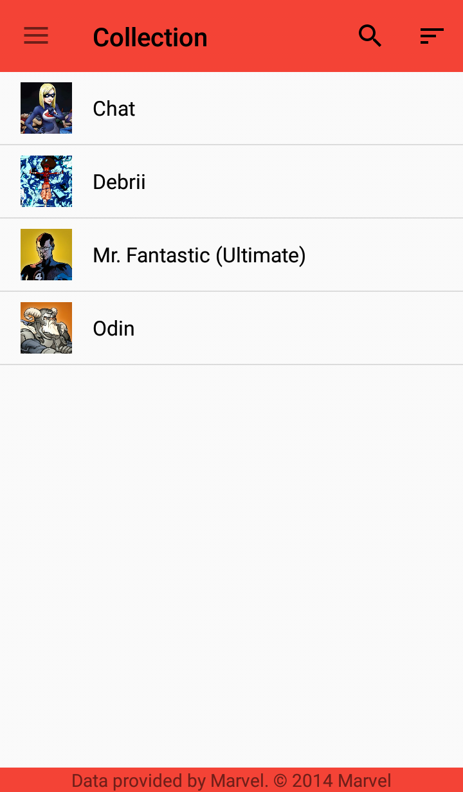
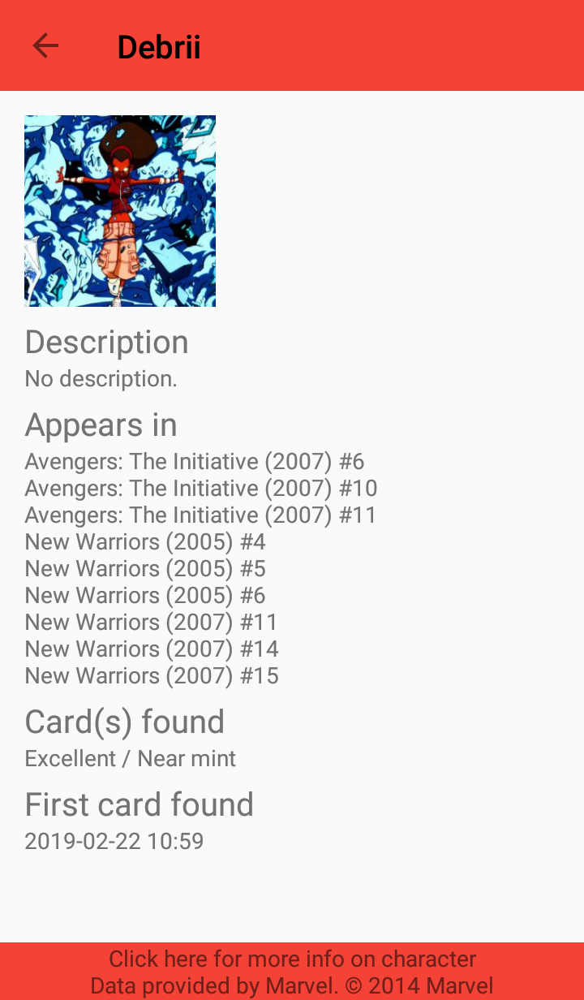
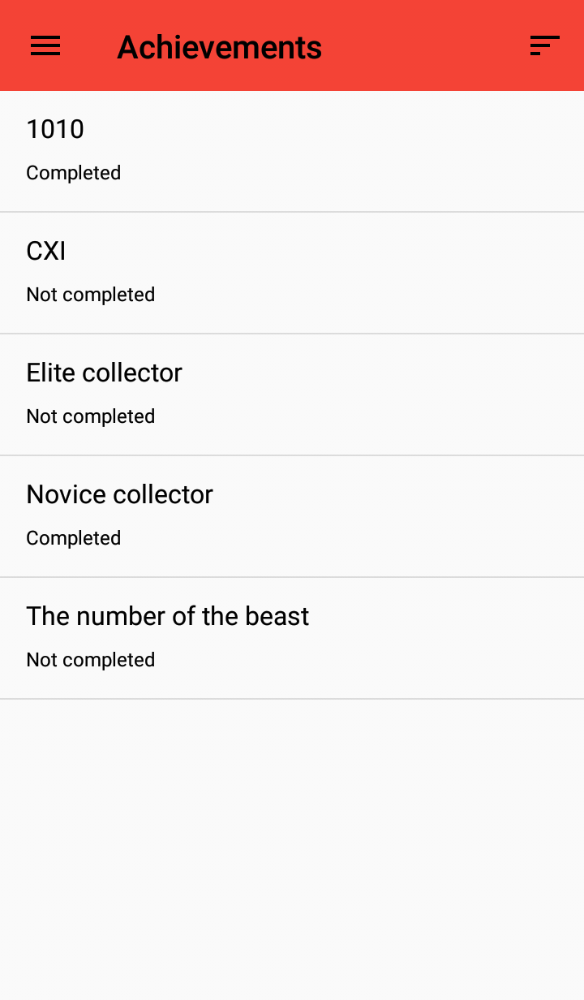
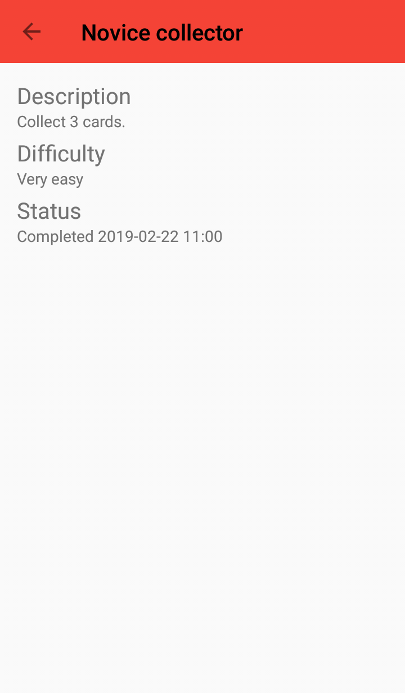

# ComicCollector
ComicCollector is a android game were the user collects cards depicting comic characters.

NOTE:
To run the game properly three keys are needed (not supplied in the project). Specifically a Google Maps API key, a Marvel public API key and a Marvel private API key. They are to be placed as string resources like so:
```
<string name="marvelPublicKey">YourKeyHere</string>
<string name="marvelPrivateKey">YourKeyHere</string>
<string name="googleMapsUnrestrictedKey">YourKeyHere</string>
```

## Screenshots
    
